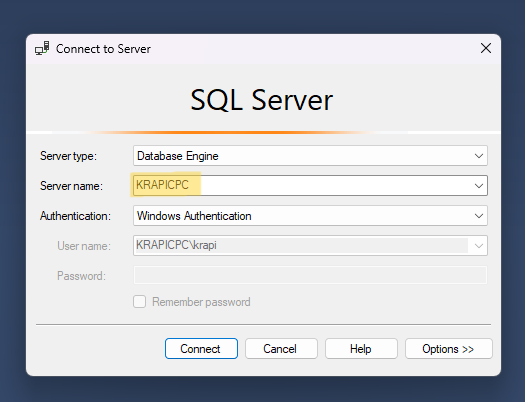
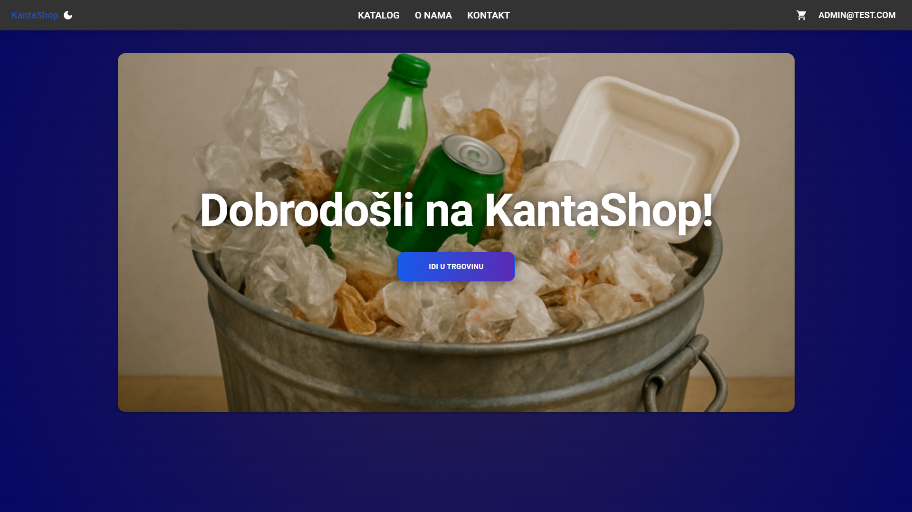
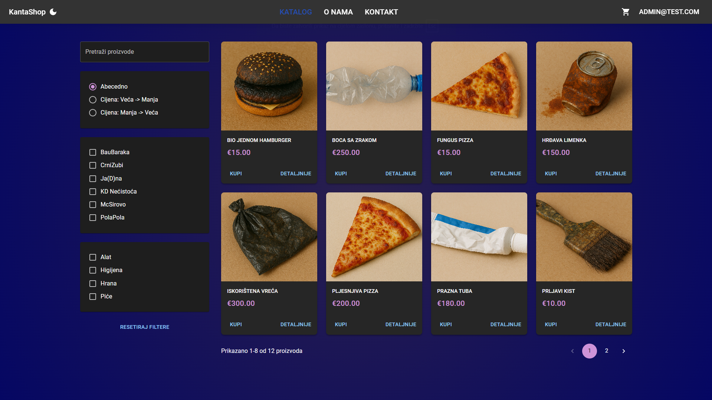
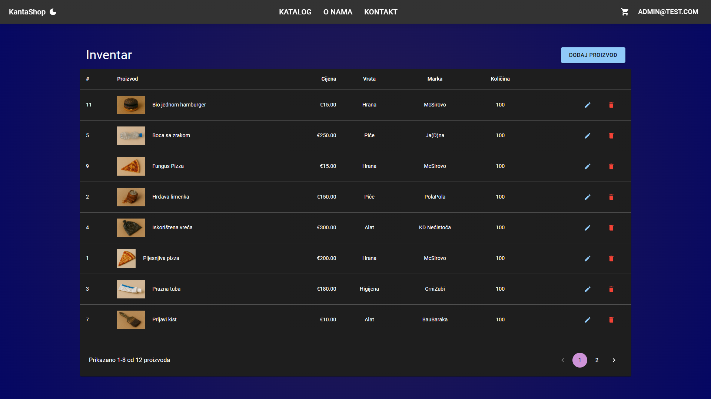
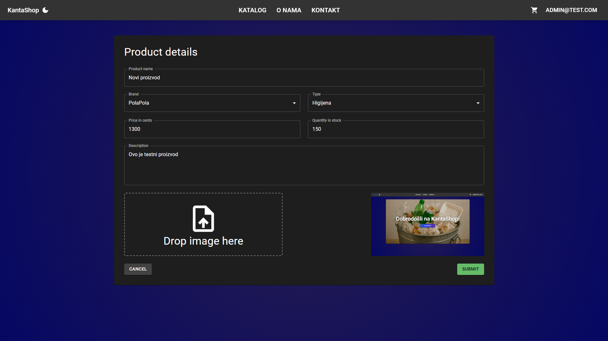
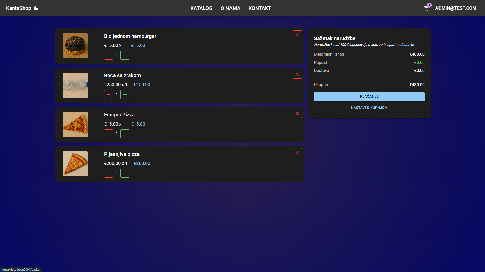
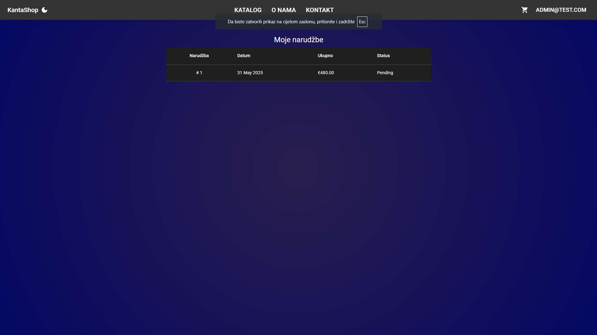

# 🪣 KantaShop – Studentski Projekt E-Trgovine

Ovo je repozitorij za studentski projekt e-trgovine **"KantaShop"**, razvijen korištenjem **.NET 9** i **React 19** tehnologija. Projekt demonstrira izradu web aplikacije s osnovnim funkcionalnostima online trgovine.

## 🔍 Kratki Opis

KantaShop je aplikacija koja korisnicima omogućuje pregledavanje proizvoda, njihovo dodavanje u košaricu te izradu narudžbi. Administratori imaju mogućnost upravljanja proizvodima.

Cilj projekta bio je primijeniti znanja stečena o modernim web tehnologijama u izradi konkretnog rješenja, s naglaskom na .NET backend i React frontend.

## 💡 Glavne Funkcionalnosti

* **Pregled proizvoda** s paginacijom, sortiranjem, filtriranjem i pretraživanjem
* **Korisnički računi**: registracija, prijava (ASP.NET Core Identity + JWT)
* **Košarica**: dodavanje, uklanjanje i izmjena sadržaja
* **Narudžbe**: kreiranje i pregled povijesti za prijavljene korisnike
* **Administracija proizvoda** (za administratore): unos, izmjena i brisanje

## 🚀 Korištene Tehnologije i Koncepti

### Backend (.NET 9)

* **ASP.NET Core Web API** (RESTful pristup s kontrolerima)
* **C#**: glavni jezik za poslovnu logiku
* **Entity Framework Core** (Code-First ORM za SQLite)
* **ASP.NET Core Identity** (autentifikacija, autorizacija, JWT)
* **AutoMapper** (mapiranje između entiteta i DTO-ova)

### Frontend (React 19)

* **React** + **TypeScript**
* **Redux Toolkit** i **RTK Query** (globalno stanje i dohvat podataka)
* **React Router** (navigacija u SPA aplikaciji)
* **Material UI (MUI)**: UI komponentna biblioteka
* **React Hook Form**: za forme i validaciju

## 🔗 Relacije u Bazi Podataka

* **One-to-Many**: Korisnik ➔ Narudžbe, Proizvod ➔ Stavke narudžbi
* **Many-to-Many**: Narudžba ➔ Više proizvoda (preko `OrderItem`)

## 🚄 Pokretanje Projekta

### Preduvjeti

* .NET 9 SDK
* Node.js (LTS verzija) ili Yarn
* Git, VS Code ili drugi IDE

> ⚠️ Napomena: Prije pokretanja, u datoteci `appsettings.Development.json` potrebno je izmijeniti naziv SQL Server instance:
> ```json
> "ConnectionStrings":{"DefaultConnection":"Server=KRAPICPC;Database=shop;Trusted_Connection=True;TrustServerCertificate=True"}
> ```
> Zamijenite `KRAPICPC` s nazivom vašeg SQL servera.<br>
> 

### Backend (API)

```bash
git clone https://github.com/Krapic/KantaShop.git
cd KantaShop/API
dotnet tool restore
dotnet tool run dotnet-ef database update
dotnet run
```

API se pokreće na: `https://localhost:5001`.

> ℹ️ Napomena o frontend pokretanju:
> Ručno pokretanje frontenda nije nužno – kada se pokrene backend s dotnet run, frontend će se automatski posluživati putem ASP.NET middlewarea (https://localhost:5001).

### Frontend (Klijent)

```bash
cd ../client
npm install     # ili yarn install
npm start       # ili yarn start
```

Aplikacija se pokreće na: `http://localhost:3000`.

## 📄 Demo Korisnici (definirani u `DbInitializer.cs`)

**Korisnik:**

* Email: `bob@test.com`
* Lozinka: `Pa$$w0rd`

**Administrator:**

* Email: `admin@test.com`
* Lozinka: `Pa$$w0rd`

---

### 💳 Testno Plaćanje (Stripe)

Za testiranje plaćanja koristi se Stripe integracija.
Možete koristiti **bilo koju od testnih kartica** dostupnih na službenoj stranici:

🔗 [Stripe testne kartice](https://docs.stripe.com/testing)

> Na primjer, najosnovnija testna kartica za uspješno plaćanje:
>
> ```
> Broj kartice: 4242 4242 4242 4242  
> Datum isteka: bilo koji budući (npr. 12/34)  
> CVC: bilo koji troznamenkasti broj (npr. 123)  
> ZIP/Poštanski broj: bilo koji (npr. 10000)
> ```

---

## 📸 Pregled Aplikacije

| Naslovnica | Katalog | Inventar |
|------------|---------|----------|
|  |  |  |

| Dodavanje proizvoda | Košarica | Moje narudžbe |
|---------------------|----------|----------------|
|  |  |  |

## 📁 Struktura Projekta

### `/API` (backend)

* `Controllers/` – API endpointi
* `Data/` – DbContext, migracije, inicijalizacija
* `DTOs/` – Data Transfer Objects
* `Entities/` – Modeli baze
* `Services/` – Poslovna logika
* `Extensions/` – Ekstenzije

### `/client` (frontend)

* `public/` – Statičke datoteke
* `src/`
  * `app/` – postavke (store, layout, api)
  * `features/` – funkcionalnosti (catalog, basket)
  * `lib/` – hookovi, utili, validacijske sheme

---

## 👤 Autor

**Frane Krapić**
